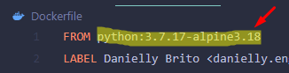
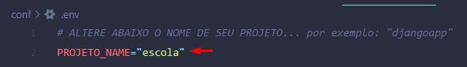

# Ambiente de desenvolvimento em Django + SQLite com Docker
Esse ambiente trata de um ambiente básico e inicial e prático de `desenvolvimento` tendo as seguintes características:
- Python (*a versão você poderá modificar*)
- Django (*a versão você poderá alterar*)
- Banco de Dados: SQLite

Antes de iniciar vou mostrar algumas personalizações possíveis:

---
### Personalizações Possíveis:

* <b>Alterando a versão do Python (Imagem do Docker):</b>

Você pode alterar a versão do python que você precisará trabalhar! Para isso você deve alterar a imagem declarada no arquivo `Dockerfile` antes de rodar o build do docker:


<br /><br />

* <b>Alterar versão do Django:</b>

Você pode alterar a versão do Django que será instalada.
Para isso basta acessar o arquivo `app/requirements.txt` e alterar a versão;
<br /><br />

* <b>Adicionando pacotes/requisitos para sua aplicação:</b>

Você pode adicionar pacotes para utilizar em sua aplicação.
Para isso basta acessar o arquivo `app/requirements.txt` e adicionar os pacotes necessários;
<br /><br />


* <b>Alterar o nome do projeto principal Django a ser criado:</b>

Você pode alterar o nome do 'projeto de start', que basicamente é o projeto inicial de sua aplicação Django. 

O nome do projeto é o que, normalmente, se define ao rodar o comando `django-admin startproject PROJETO_NAME . `

Para alterar o nome do projeto a ser criado você precisará duplicar o arquivo `conf/.env-example` e renomear para `conf/.env`. 
Assim, no arquivo `conf/.env` altere os dados da variável 'PROJETO_NAME':
 

 > <i> Caso nenhum valor for definido pela variável PROJETO_NAME ele criará um projeto com o nome padrão de 'djangoapp' </i>

<br />

* <b>Alterar o nome do Container a ser criado</b>

Você pode alterar o nome do container que sua aplicação será criada.
Para isso basta alterar o parâmetro: `container_name: [NOME-DO-CONTAINER]` substuindo o nome do container antes que seja "buildado" a aplicação!

---
<br />

## Pré-requisitos:
Tenha certeza de que você tenha o [Docker](https://docs.docker.com/get-docker/) instalado em seu computador.

A primeira coisa a se fazer é criar nosso arquivo de configuração `.env` para isso crie uma cópia do arquivo `.env-example` e nomei-o para: `.env` dentro da pasta 'conf/'.

O arquivo `.env` contêm algumas informações que precisam ser definidas, nos comentários do `.env-example` já tem algums dicas do que se trata cada variável.

Após isso acesse, via terminal/cmd, esse repositório. Tenha certeza de que você esteja no mesmo diretório do `docker-compose.yml` para que você inicie então a instalação!

## Instalação

Rode então o comando para construir a imagem do container e subir o container:

```bash
docker compose up -d --build
```
    
Para confirmar que está tudo funcionando rode:
```bash
docker container ls
```

 > <i> O comando de build acima só precisará ser feito uma única vez, pois uma vez que você subir essa imagem e não alterá-la você não precisará mais construí-la</i>

<br />
 
## Usando o ambiente em desenvolvimento

#### Executando Comandos:
Com os containers em execução você pode executar os comandos do django (python manage.py ...) de duas formas:

```bash
# acessando diretamente o container 'por dentro' tendo acesso ao bash/ash/sh do container
docker exec -it [NOME_DO_CONTAINER] bash

# caso esteja usando uma imagem `alpine` use o `ash`
# no meu caso:
docker exec -it escola-DjangoAPI-Study ash
```
 > <i>para sair - NESSE AMBIENTE EM ESPECÍFICO - você pode digitar `exit` que ele não matará o container, já que o comando que está mantendo o container 'vivo' não é o terminal</i>

Outra forma de executar comandos no container é fazendo isso sem 'entrar' dentro do container:

```bash
docker exec -it [NOME_DO_CONTAINER] [COMANDO]

# no meu caso:
docker exec -it escola-DjangoAPI-Study ls -lha

# ou até rodando as migrations por exemplo:
docker exec -it escola-DjangoAPI-Study python manage.py migrate --noinput
```
---
####  Rodando as migrations:


```bash
docker exec -it escola-DjangoAPI-Study python manage.py migrate --noinput
```
---
####  Parar todos os Containers em execução:


```bash
docker container stop [NOME_DO_CONTAINER]

# nesse caso, caso eu queira pausar os dois containers de uma vez:
docker container stop escola-DjangoAPI-Study

# ou outra opção:
docker compose stop
```
---
####  Startar/Re-startar todos os Containers do projeto 'stopados'/parados:


```bash
docker compose up -d

# outra oção seria através do `docker container start CONTAINER`
docker container start escola-DjangoAPI-Study
```


---
####  Re-buildar a imagem forçadamente


```bash
docker compose up -d --build --force-recreate
```
